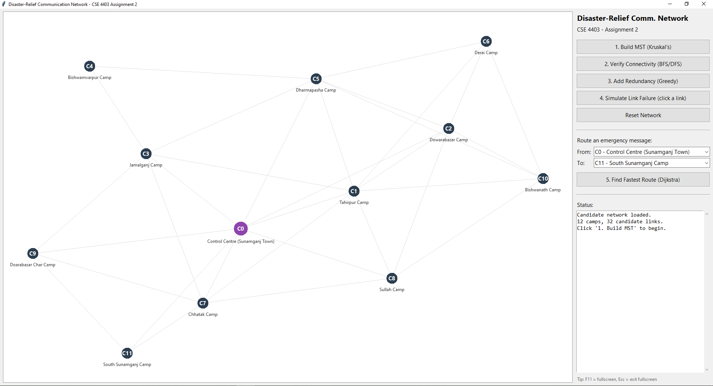

# Disaster-Relief Communication Network

**CSE 4403 (Algorithms) — Assignment 2 (Quiz 4 equivalent)**
Implementation of the problem originally proposed by Talha Bin Monir
(230041238) in Assignment 3: *"Design of a Cost-Efficient, Fault-Tolerant
Communication Network for Disaster-Relief Camps."*


## Contributors

| Name | ID |
|---|---|
| S. M. Solaiman Kalam | 230041254 |
| Talha Bin Monir | 230041238 |
| Md. Shihab Alam Khan | 230041236 |

Demo Video Link: [Youtube Link](https://youtu.be/abWO02mRUhQ)



## What this is

After a disaster, relief camps need a temporary wireless relay network.
This project:

1. **Builds the cheapest backbone network** connecting every camp
   (merge sort + Kruskal's MST).
2. **Verifies full connectivity** and detects which camps a failure
   isolates (BFS/DFS).
3. **Adds fault-tolerant redundancy** to a bare MST, which is a tree and
   therefore breaks on any single link failure (greedy augmentation).
4. **Simulates link/tower failures** and re-checks connectivity.
5. **Routes emergency messages** between any two camps on the fastest
   (lowest-delay) available path, recomputed after failures
   (Dijkstra's algorithm).

## Requirements

- Python 3.9+ (standard library only — **no `pip install` needed**).
- Tkinter, for the GUI. It ships with the official Windows/macOS Python
  installer by default. On Linux, install it with e.g.
  `sudo apt install python3-tk` if `python3 gui_app.py` complains it's
  missing.

## Project layout

```
disaster_relief_network/
├── network/
│   ├── graph.py         # adjacency-list weighted graph (Edge, Graph)
│   ├── sorting.py       # merge sort
│   ├── union_find.py    # Disjoint-Set Union (path compression + rank)
│   ├── mst.py            # Kruskal's algorithm
│   ├── traversal.py       # BFS, DFS, connected components, isolation check
│   ├── dijkstra.py         # Dijkstra's shortest path (binary heap)
│   ├── redundancy.py        # greedy fault-tolerance augmentation
│   └── simulation.py         # link/tower failure simulation
├── data/
│   └── camps.py          # sample 12-camp dataset (Sylhet/Sunamganj flood scenario)
├── tests/
│   └── test_algorithms.py  # unit tests for every algorithm
├── cli_demo.py             # scripted end-to-end text walkthrough
├── gui_app.py               # interactive Tkinter visualizer (for the video)
└── README.md
```

## How to run

**Quick text demo**:

```bash
python cli_demo.py
```

**Interactive visual demo**:

```bash
python gui_app.py
```

**Unit tests:**

```bash
python -m unittest discover -s tests -v
```

## Suggested demo-video script (≈ 3–4 minutes)

1. Launch `gui_app.py`. Briefly explain the scenario: 12 relief camps
   around Sunamganj after flooding, grey lines are candidate relay links.
2. Click **"1. Build MST (Kruskal's)"** — explain that installation cost
   is minimized; note total cost in the status panel.
3. Click **"2. Verify Connectivity (BFS/DFS)"** — confirm every camp is
   reachable from the control centre.
4. Click **"4. Simulate Link Failure"**, then click a green backbone link
   on the canvas — it turns red, and any camp cut off turns red too.
   Explain: *a pure MST has no redundancy, so one failure can partition
   the network.*
5. Click **"Reset Network"**, rebuild the MST, then click
   **"3. Add Redundancy (Greedy)"** — blue dashed links appear. Repeat the
   same failure — the network now stays connected.
6. Pick two camps in the "Route an emergency message" dropdowns and click
   **"5. Find Fastest Route (Dijkstra)"** — the path highlights in orange
   with its total delay.
7. Fail a link on that highlighted path and click **Dijkstra** again to
   show it automatically re-routes.
8. Wrap up by summarising which algorithm did which job (sort → Kruskal →
   BFS/DFS → greedy redundancy → Dijkstra), tying back to the report.

Upload the recording to YouTube (unlisted is fine) and paste the link into
the report.

## Algorithm summary & complexity

| Stage | Algorithm | Complexity | Purpose |
|---|---|---|---|
| Order candidate links | Merge sort | O(E log E) | Prerequisite for Kruskal's |
| Backbone construction | Kruskal's MST + Union-Find | O(E log E) | Minimum-cost network connecting all camps |
| Connectivity check | BFS / DFS | O(V + E) | Detect isolated camps after any failure |
| Fault tolerance | Greedy augmentation | O(E log E) | Raise min camp degree to ≥ 2 within budget |
| Routing | Dijkstra (binary heap) | O((V+E) log V) | Fastest path for emergency messages, recomputed after damage |

## Notes on the dataset

`data/camps.py` uses a synthetic but structurally realistic dataset (camp
coordinates, distances, a terrain-difficulty multiplier for "hard" links)
themed on the Sylhet/Sunamganj haor flooding referenced elsewhere in the
group's Assignment 3 reports. Swap in real coordinates/costs by editing
`CAMPS` and `_HARD_TERRAIN_EDGES` in that file — no other file needs to
change.
